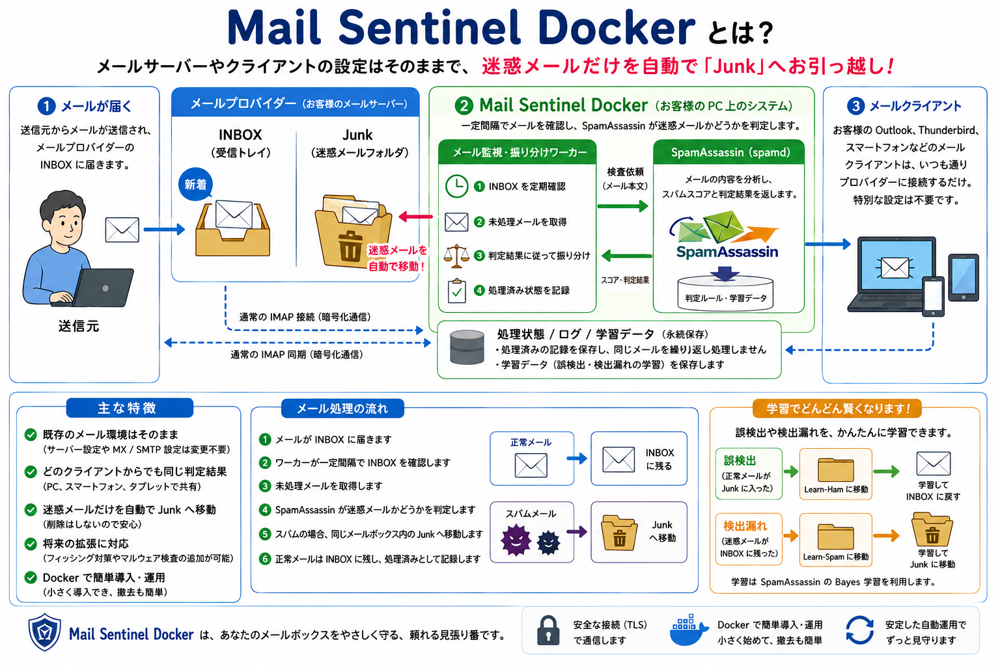

# Mail Sentinel Docker



Mail Sentinel Dockerは、IMAPメールボックスの新着メールをSpamAssassinで検査し、迷惑メールを同じメールボックスのJunkフォルダーへ移動するDocker Composeベースのメール振り分けシステムです。

既存のSMTP/MX設定やメール配送経路は変更しません。普段使っているメールクライアントと同様にIMAPで接続するため、PCやスマートフォンからも振り分け結果を共有できます。

## 主な機能

- 複数のIMAPアカウントを定期監視
- SpamAssassinによるスパム判定
- スパムをJunkへ移動し、正常メールはINBOXに保持
- IMAPキーワードまたはローカルSQLiteによる処理済み管理
- `Learn-Ham` / `Learn-Spam`フォルダーを使ったフィードバック学習
- 既存メールの初期学習と初期スキャン
- 起動前診断、ドライラン、JSON形式のログ
- SpamAssassinルールの更新、永続データのバックアップと復元
- GreenMailとRoundcubeを使ったローカル統合テスト環境

## 注意事項

本ソフトウェアはIMAPメールボックスのフラグ変更とメール移動を行います。実メールボックスへ接続する前にバックアップを取得し、メールプロバイダーの利用条件、IMAP仕様、対象フォルダーを確認してください。

初回は必ず`DRY_RUN=true`のまま起動してください。ドライランではメールの取得と採点のみを行い、移動、削除、フラグ変更は行いません。メールの自動削除、OAuth 2.0トークンの自動更新、管理画面には対応していません。

## 必要なもの

- Docker Engine
- Docker Compose v2（`docker compose`コマンド）
- IMAPまたはIMAPSを利用できるメールアカウント
- パスワードまたはアプリパスワード

WindowsではDocker DesktopのLinuxコンテナ（既定）を使用してください。`docker info --format '{{.OSType}}'`が`windows`を表示する場合だけ、Docker Desktopのメニューから`Switch to Linux containers`を選択します。

## クイックスタート

以下のコマンドはリポジトリのルートで実行します。

### 1. 設定ファイルを用意する

macOS / Linux:

```sh
mkdir -p config secrets
cp accounts.example.json config/accounts.json
cp docker-compose.accounts.example.yml config/docker-compose.accounts.yml
```

Windows PowerShell:

```powershell
New-Item -ItemType Directory -Force -Path config, secrets | Out-Null
Copy-Item accounts.example.json config/accounts.json
Copy-Item docker-compose.accounts.example.yml config/docker-compose.accounts.yml
```

`config/accounts.json`を編集し、少なくとも次の値を実際のメール環境に合わせます。

```json
{
  "accounts": [
    {
      "name": "primary",
      "environment": {
        "IMAP_HOST": "imap.example.com",
        "IMAP_USERNAME": "user@example.com",
        "IMAP_PASSWORD_FILE": "/run/secrets/imap_primary_password",
        "IMAP_JUNK": "Junk"
      }
    }
  ]
}
```

実際には、コピーしたファイルの`defaults`も残してください。初回確認が終わるまでは`DRY_RUN`を`true`にします。

`IMAP_JUNK`と完全一致するフォルダーが優先されます。存在しない場合だけ、IMAPサーバーが通知する唯一の`\Junk` Special-Useフォルダーへフォールバックします。詳細は[ユーザーガイド](docs/user-guide.md#42-junkフォルダーの指定とjunk属性)を参照してください。

### 2. IMAPパスワードを保存する

macOS / Linux:

```sh
printf 'IMAP password: '
read -r -s IMAP_PASSWORD
printf '\n'
printf '%s' "$IMAP_PASSWORD" > secrets/imap_primary_password
unset IMAP_PASSWORD
chmod 600 secrets/imap_primary_password
```

パスワードを`accounts.json`へ直接記載しないでください。`config/*`と`secrets/*`は`.gitignore`で除外されています。

Gmailへ接続する場合、通常のGoogleアカウントパスワードは使用できません。Googleアカウントで2段階認証を有効にして[アプリパスワード](https://support.google.com/accounts/answer/2461835)を発行し、その値をSecretファイルへ保存します。`config/accounts.json`では`IMAP_HOST`を`imap.gmail.com`、`IMAP_AUTH_METHOD`を`app_password`に設定してください。Google Workspaceの管理ポリシーや高度な保護機能によりアプリパスワードを利用できない場合があります。詳しくは[ユーザーガイドのGmail設定](docs/user-guide.md#45-gmailで使用する場合)を参照してください。

### 3. 構成を検証して起動する

```sh
docker compose -f docker-compose.yml -f config/docker-compose.accounts.yml config --quiet
docker compose -f docker-compose.yml -f config/docker-compose.accounts.yml build
docker compose -f docker-compose.yml -f config/docker-compose.accounts.yml up -d
```

### 4. 診断結果とドライランを確認する

```sh
docker compose -f docker-compose.yml -f config/docker-compose.accounts.yml ps
docker compose -f docker-compose.yml -f config/docker-compose.accounts.yml logs -f worker
```

ログで`startup_diagnostic_complete`が`pass`になり、`message_classified`の判定と`would_move` / `would_mark`が意図どおりであることを確認します。

診断だけを実行する場合:

```sh
docker compose -f docker-compose.yml -f config/docker-compose.accounts.yml run --rm worker /usr/local/bin/mail-sentinel-supervisor --diagnose
```

### 5. 通常運転へ切り替える

診断、Junkフォルダー名、判定結果を確認した後、`config/accounts.json`の`DRY_RUN`を`false`へ変更してworkerを再作成します。

```sh
docker compose -f docker-compose.yml -f config/docker-compose.accounts.yml up -d --force-recreate worker
```

## よく使うコマンド

```sh
# 状態確認
docker compose -f docker-compose.yml -f config/docker-compose.accounts.yml ps

# workerのログ
docker compose -f docker-compose.yml -f config/docker-compose.accounts.yml logs -f worker

# 再起動
docker compose -f docker-compose.yml -f config/docker-compose.accounts.yml restart worker

# 停止（永続ボリュームは残す）
docker compose -f docker-compose.yml -f config/docker-compose.accounts.yml down

# SpamAssassinルールの更新
docker compose -f docker-compose.yml -f config/docker-compose.accounts.yml run --rm spamassassin update-rules
docker compose -f docker-compose.yml -f config/docker-compose.accounts.yml restart spamassassin
```

`down -v`は処理状態、Bayes学習データ、SpamAssassinルールを含む永続ボリュームを削除するため、通常運用では実行しないでください。

## 構成

| コンポーネント | 役割 |
| --- | --- |
| `worker` | IMAPの監視、メールの採点依頼、振り分け、学習処理 |
| `spamassassin` | `spamd`によるスパム判定とBayes学習 |
| `admin` | 初期学習、初期スキャンなどの管理操作 |
| `maintenance` | 永続データのバックアップと復元 |

コンテナは原則として非root、読み取り専用ファイルシステム、全Capability破棄、`no-new-privileges`で実行されます。バックアップと復元を行う`maintenance`だけが、明示的なプロファイルで必要最小限のファイル操作権限を使用します。

## テスト

Pythonの単体テストは標準ライブラリの`unittest`で実行できます。

```sh
python3 -m unittest discover -s tests -v
```

実際のIMAP操作を含むローカル統合テストについては[GreenMailによるローカルテスト](docs/greenmail-test.md)を参照してください。

## サポート・問い合わせ

インストール、設定、操作方法についての質問は、[Q&Aを新規作成](https://github.com/Shimahukuro/mail-sentinel-docker/discussions/new?category=q-a)から投稿してください。リンクを開くと、GitHub DiscussionsのQ&Aカテゴリを選択した新規投稿フォームが表示されます。質問には、利用OS、Dockerのバージョン、実行したコマンド、Secretを除いたエラーメッセージを記載すると状況を確認しやすくなります。

不具合報告と機能要望は[GitHub Issues](https://github.com/Shimahukuro/mail-sentinel-docker/issues)を利用してください。パスワード、アクセストークン、実際のメールアドレス、メール本文などの機密情報は、DiscussionやIssueへ投稿しないでください。

脆弱性の可能性がある問題は公開投稿せず、[Security Policy](.github/SECURITY.md)に従ってGitHubのPrivate vulnerability reportingから非公開で報告してください。

## ドキュメント

- [クイックスタート](docs/quick-start.md) — cloneからドライラン、本番運用への切り替えまでの最短手順
- [ユーザーガイド](docs/user-guide.md) — 詳細な導入手順、設定、初期学習、初期スキャン、トラブルシューティング
- [最小セットアップ](docs/poc-setup.md) — 最短の検証手順
- [システム概要](docs/system-overview.md) — アーキテクチャ、処理フロー、設計原則
- [運用Runbook](docs/operations-runbook.md) — 監視、障害対応、通知、ルール更新、バックアップと復元
- [GreenMailによるローカルテスト](docs/greenmail-test.md) — GreenMailとRoundcubeを使った検証
- [サードパーティ通知](THIRD_PARTY_NOTICES.md)

## ライセンス

[Apache License 2.0](LICENSE)
