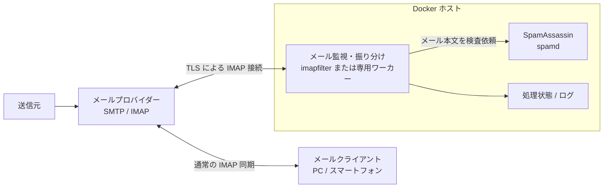
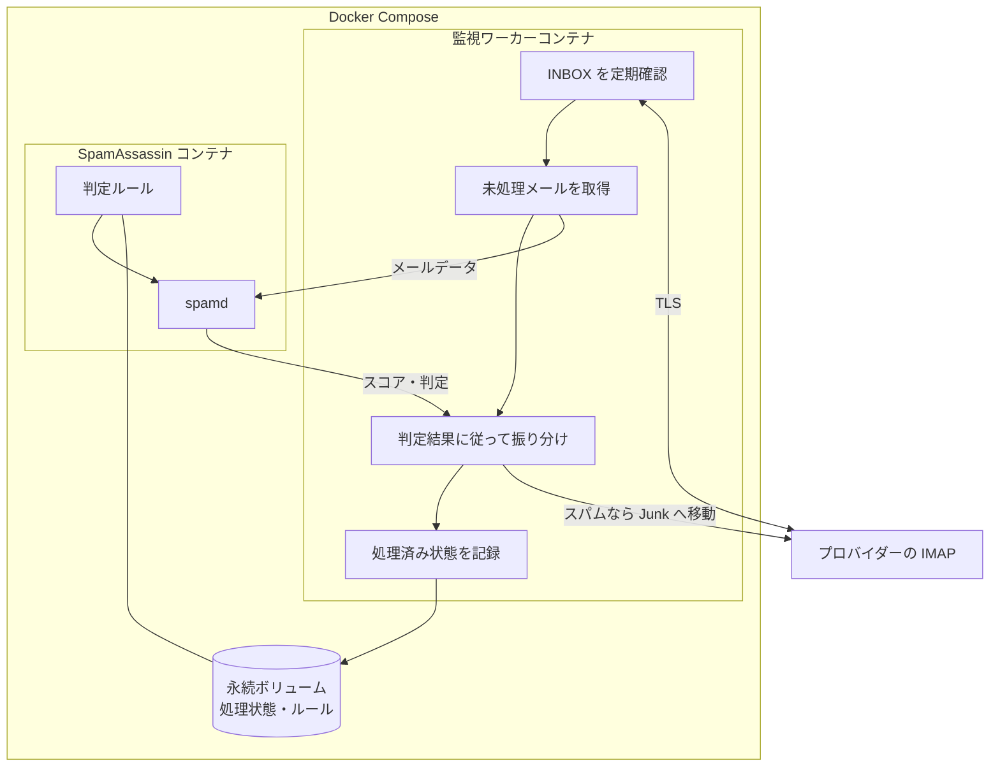
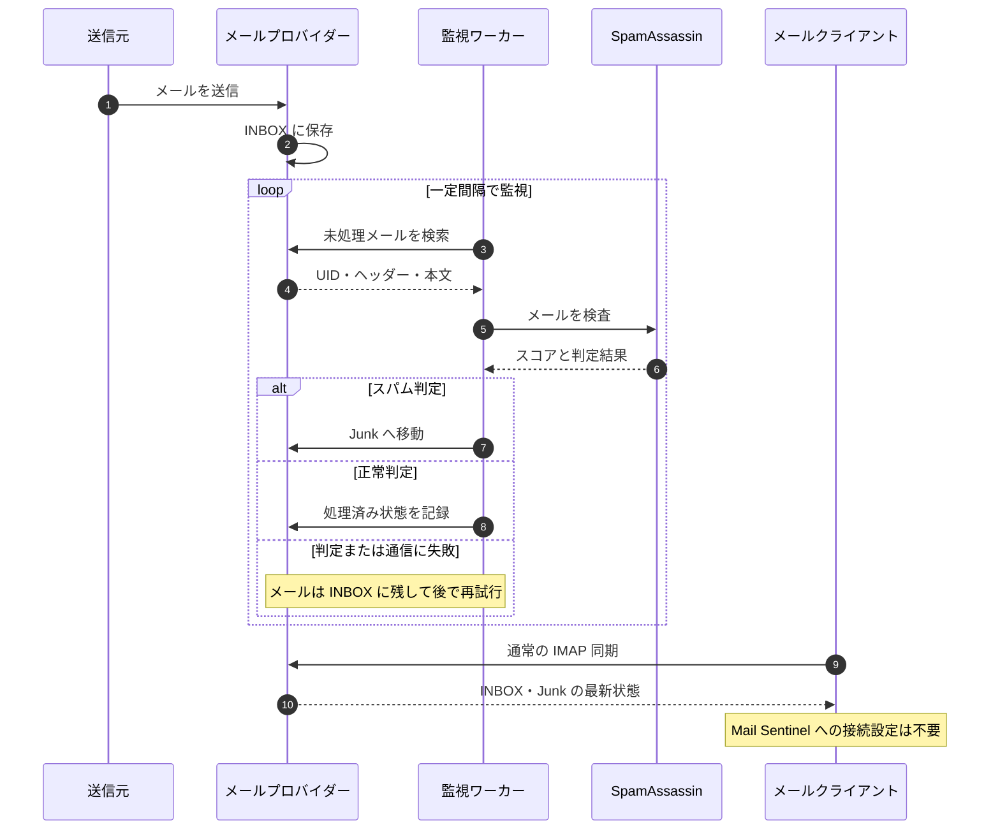
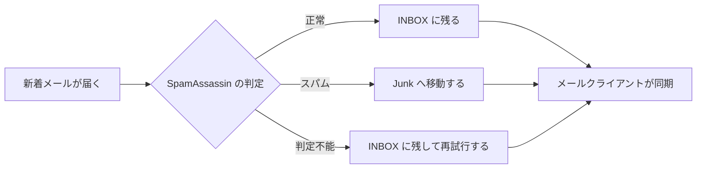
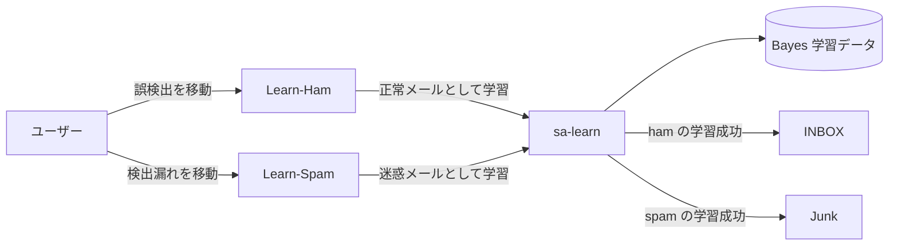
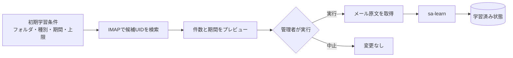
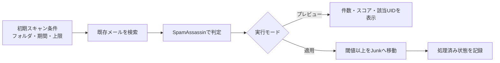
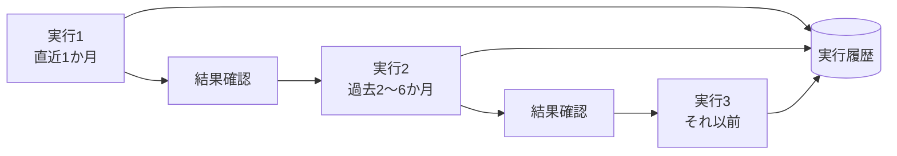
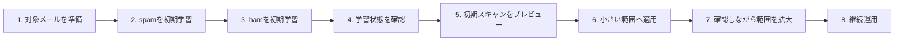

# Mail Sentinel Docker システム概要

## 1. 目的

Mail Sentinel Docker は、既存のメール配送環境を変更せず、IMAP メールボックスに届いたメールを SpamAssassin で検査し、迷惑メールと判定したメッセージを Junk フォルダへ移動するシステムである。

メールクライアント、メールプロバイダーの SMTP/MX 設定、およびメール配送経路には介入しない。システムは通常の IMAP クライアントとしてメールボックスへ接続し、バックグラウンドでメールを整理する。

## 2. 解決する課題

- プロバイダーの迷惑メール対策だけでは十分でないメールボックスを補完する
- Outlook、Thunderbird、Apple Mail、スマートフォンなど、利用するクライアントに依存せず同じ判定結果を共有する
- 既存のメールサーバー構成を変更せず、小さく導入・撤去できるようにする
- 将来、フィッシング対策やマルウェア検査などを追加できる基盤を用意する

## 3. システム構成



この構成では、メールクライアントと Mail Sentinel は互いに直接通信しない。どちらも独立した IMAP クライアントとして、同じメールプロバイダー上のメールボックスを参照する。

### 3.1 コンポーネント

| コンポーネント | 責務 |
| --- | --- |
| メールプロバイダー | メールの受信、保存、および IMAP によるメールボックス操作を提供する |
| メールクライアント | 従来どおりプロバイダーへ接続し、メールを表示・送信する |
| メール監視・振り分けワーカー | INBOX の未処理メールを取得し、SpamAssassin の結果に従ってメールを振り分ける |
| SpamAssassin (`spamd`) | メールのヘッダーと本文を解析し、スパムスコアと判定結果を返す |
| Docker Compose | ワーカーと SpamAssassin の起動、ネットワーク、永続化、および再起動を管理する |

ワーカーには `imapfilter` の利用を第一候補とする。ただし、再試行、処理済み管理、メトリクスなどの要件が増えた場合は、専用ワーカーへの置き換えを検討する。SpamAssassin はワーカーと同じ内部 Docker ネットワークに配置し、ホスト外へ直接公開しない。

### 3.2 コンテナ内部の役割



## 4. メール処理フロー

1. メールプロバイダーが新着メールを INBOX に保存する。
2. ワーカーが一定間隔で INBOX を確認する。
3. ワーカーが未処理メールのヘッダーと本文を取得する。
4. ワーカーがメールを `spamd` に渡し、スパムスコアと判定結果を受け取る。
5. スパムの場合、ワーカーが同じメールボックス内の Junk フォルダへ移動する。
6. 正常メールの場合、INBOX に残したまま処理済みとして扱う。
7. メールクライアントは次回の IMAP 同期時に、プロバイダー上の最新状態を表示する。

IMAP サーバーが `MOVE` をサポートしない場合は、`COPY`、元メッセージへの削除フラグ付与、`EXPUNGE` の組み合わせで代替する。この場合は、処理途中の失敗による重複や消失を防ぐ設計と検証が必要になる。

### 4.1 処理シーケンス



### 4.2 利用者から見える動き



## 5. 判定と処理済み管理

### 5.1 基本方針

- SpamAssassin のスコアが設定した閾値以上の場合にスパムとする
- 初期導入では誤判定の影響を抑えるため、削除せず Junk フォルダへ移動する
- 正常メールは内容を変更せず INBOX に残す
- 同じメールを繰り返し検査しないよう、処理済み状態を管理する

### 5.2 処理済み状態の候補

プロバイダーの互換性を確認したうえで、次のいずれかを採用する。

- IMAP キーワード（例: `MailSentinelChecked`）を付与する
- UIDVALIDITY と UID の組をローカル状態として保存する
- 専用の処理対象フォルダを利用する

既読・未読フラグは利用者の操作と競合するため、処理済み管理には使用しない。

### 5.3 件名・ヘッダーの変更

初期版では件名への `[SPAM]` 付与や元メールの書き換えは行わない。IMAP 上のメール内容変更は、実質的に新しいメッセージの追加と元メッセージの削除になる場合があり、重複やメッセージ識別子の変化を招くためである。

必要になった場合は、判定済みメールのコピーへ SpamAssassin のヘッダーを追加する方式を、互換性試験後にオプションとして提供する。

### 5.4 ユーザーフィードバックによる学習

誤検出と検出漏れを訂正するため、メールボックスに次の2つの学習用 IMAP フォルダを設ける。

| フォルダ | ユーザーが入れるメール | 学習方法 | 学習成功後の移動先 |
| --- | --- | --- | --- |
| `Learn-Ham` | Junk に移動された正常メール | `spamc -L ham`（`sa-learn --ham`相当） | INBOX |
| `Learn-Spam` | INBOX に残った迷惑メール | `spamc -L spam`（`sa-learn --spam`相当） | Junk |



監視ワーカーは学習用フォルダを定期的に確認し、次の順序で処理する。

1. 対象メールの UID と内容を取得する。
2. 学習済み記録を確認し、同じ指示の重複実行を防ぐ。
3. SpamAssassin コンテナへメールと学習種別を渡す。
4. `spamd`のTELLインターフェースを通じて、`sa-learn --ham`または`sa-learn --spam`相当の学習を実行する。
5. 学習成功を確認してから、メールを INBOX または Junk へ移動する。
6. UID、学習種別、処理日時、結果を監査ログと処理状態へ記録する。

学習に失敗した場合、メールは学習用フォルダに残して再試行する。メールを先に移動すると学習失敗をユーザーが認識できなくなるため、移動は必ず学習成功後に行う。

`Learn-Ham` からの操作を送信者の許可リストへ自動反映してはならない。差出人ヘッダーは詐称できるため、許可設定や個別ルールのスコア変更は、判定根拠と複数の事例を管理者が確認したうえで別途行う。

Bayes 学習データは SpamAssassin の永続ボリュームへ保存し、コンテナの再作成後も維持する。学習はアカウント単位で分離することを原則とし、複数利用者のメールを一つの学習データへ混在させるかどうかは、運用対象を拡大する際に改めて決定する。

### 5.5 既存メールによる初期学習

既存の Junk フォルダおよび確認済み正常メールのフォルダを、Bayes 分類器の初期学習に利用できるようにする。初期学習は通常監視とは分離した明示的な管理操作とし、対象フォルダ、学習種別、期間および最大件数を指定して実行する。

日付範囲の判定には、原則としてメールの `Date` ヘッダーではなく、IMAP サーバーが保持する受信日時 `INTERNALDATE` を使用する。`Date` ヘッダーは送信者による設定誤りや詐称の影響を受けるためである。

期間は開始日時を含み、終了日時を含まない半開区間として扱う。例えば、2026年7月のメールを対象にする場合は次の範囲になる。

```text
2026-07-01T00:00:00+09:00 <= INTERNALDATE < 2026-08-01T00:00:00+09:00
```



初期学習では次の条件を指定可能にする。

| 条件 | 内容 |
| --- | --- |
| 対象フォルダ | 例: `Junk`、`Initial-Learn-Ham` |
| 学習種別 | `spam` または `ham` |
| 開始日時 | この日時以降を対象にする。省略時は下限なし |
| 終了日時 | この日時より前を対象にする。省略時は上限なし |
| タイムゾーン | 入力日時の解釈に使用する。既定値はシステム設定値 |
| 最大件数 | 誤操作による大量学習を防止する上限 |
| バッチ件数 | 一度に取得・学習するメール数 |
| プレビュー | 学習せず、対象件数、最古日時、最新日時だけを表示する |

IMAP の日付検索はサーバーによって日単位になる場合があるため、ワーカーは検索結果の各メッセージから `INTERNALDATE` を取得し、指定された日時範囲で再度厳密に絞り込む。処理順は原則として古いメールから新しいメールとする。

安全のため、初期学習は次の手順で行う。

1. プレビューモードで対象件数と期間を確認する。
2. 必要に応じてメールクライアント上で誤分類メールを対象フォルダから除外する。
3. 最大件数を指定して学習を実行する。
4. 各メールについて UIDVALIDITY、UID、学習種別および結果を記録する。
5. 学習後も元メールは移動・削除しない。
6. spam と同じ時期の確認済み ham も学習させ、データの偏りを抑える。

同じメールを反対の種別で再学習する場合は、訂正操作として記録する。通常の再実行では学習済みメールをスキップし、明示的に再学習を指定した場合だけ SpamAssassin 側の分類を訂正する。

### 5.6 既存メールへの初期ルール適用

システム導入時、すでに INBOX に存在するメールへ現在の SpamAssassin ルールを適用するため、初期スキャン機能を設ける。初期スキャンは5.5節の初期学習とは別の処理である。

- **初期学習:** 正解が確認済みのメールを使って Bayes 学習データを作る
- **初期スキャン:** 学習・設定済みのルールで既存メールを採点し、スパムを Junk へ移動する



初期スキャンでは次の条件を指定可能にする。

| 条件 | 内容 |
| --- | --- |
| 対象フォルダ | 初期値は INBOX。学習用フォルダと Junk は対象外 |
| 開始・終了日時 | `INTERNALDATE` による半開区間 |
| 最大検査件数 | 一度の実行で採点する上限 |
| 最大移動件数 | 設定誤りによる大量移動を防ぐ上限 |
| バッチ件数 | 一度に取得・判定するメール数 |
| スコア閾値 | 通常監視と同じ値を既定とし、実行記録に保存する |
| プレビュー | メールを移動せず、判定結果だけを集計する |

安全のため、初回は必ずプレビューモードで実行する。プレビューでは、対象件数、スパム候補件数、スコア分布、最古・最新日時、および各候補の UID、受信日時、件名、送信者、スコア、命中ルールを確認できるようにする。件名と送信者は機密情報を含み得るため、通常ログへは残さず、管理操作の結果としてのみ表示する。

適用モードでは、次の順序で処理する。

1. IMAP で候補 UID を検索し、`INTERNALDATE` で期間を厳密に絞り込む。
2. 処理済み状態を確認し、同じルールセットで判定済みのメールを除外する。
3. 古いメールから順に SpamAssassin で判定する。
4. 閾値以上のメールを Junk へ移動する。
5. 正常判定を含む全結果を処理状態へ記録する。
6. 最大検査件数または最大移動件数に達したら安全に停止する。

各結果には、アカウント、フォルダ、UIDVALIDITY、UID、`INTERNALDATE`、スコア、命中ルール、ルールセット識別子、判定日時および移動結果を記録する。ルールセット識別子には、SpamAssassin のバージョン、ルール更新日時およびローカル設定のハッシュを用い、どのルールで判定したか追跡可能にする。

初期スキャンが中断した場合は、処理済み状態を基に未処理メールから再開する。移動失敗時は処理済みにせず、メールを INBOX に残して再試行する。初期スキャン中も通常監視は継続できるが、同一アカウントに対する同時処理をロックし、同じメールの二重判定・二重移動を防止する。

ルール更新後に既存メールを再評価する機能は、初期スキャンとは分けて明示的に実行する。再評価時も既定ではプレビューのみとし、過去に正常と判定したメールを新しいルールで一括移動する操作には管理者の明示指定を必要とする。

### 5.7 範囲を変えた複数回実行

初期学習と初期スキャンは、一度限りのセットアップ処理ではなく、適用範囲を指定して複数回実行できる管理ジョブとして実装する。例えば、最初に直近1か月を試し、結果を確認してから過去6か月、1年へ段階的に範囲を広げられるようにする。



各実行には一意な実行 ID を発行し、次を記録する。

| 項目 | 内容 |
| --- | --- |
| 実行種別 | 初期学習または初期スキャン |
| 実行モード | プレビューまたは適用 |
| 適用範囲 | アカウント、フォルダ、開始・終了日時 |
| 学習条件 | `ham`／`spam`。初期学習の場合のみ |
| 判定条件 | スコア閾値とルールセット識別子。初期スキャンの場合のみ |
| 制限 | 最大件数、最大移動件数、バッチ件数 |
| 進捗 | 対象、処理済み、成功、失敗、スキップの件数 |
| 状態 | 待機中、実行中、完了、中断、失敗 |
| 時刻 | 作成、開始、終了日時 |

範囲が以前の実行と重複しても、安全に実行できるようにする。

- 初期学習では、同じメッセージダイジェストと同じ学習種別の組を学習済みならスキップする
- 同じメールを反対の学習種別で指定した場合は、訂正として明示確認後に再学習する
- 初期スキャンでは、同じ UID と同じルールセットで判定済みならスキップする
- ルールセットが変わったメールは再評価候補にできるが、既定ではプレビューに限定する
- UIDVALIDITY が変化した場合は UID だけを信用せず、メッセージダイジェストも利用して重複を判断する

初期学習と初期スキャンは独立したジョブとし、暗黙に互いを開始しない。同時に同じアカウントとフォルダを操作するジョブは直列化するが、対象が競合しないジョブは並行実行可能とする。

中断した実行は同じ実行 ID で再開する。条件を変更する場合は新しい実行 ID を作成し、以前の実行履歴を上書きしない。これにより、どの範囲へ何を適用したかを後から追跡できる。

運用上は、次のように小さな範囲から段階的に広げることを推奨する。

1. プレビューで対象と結果を確認する。
2. 件数上限を設定して小規模に適用する。
3. 誤判定、失敗、処理時間を確認する。
4. 重複しない次の期間、またはより広い期間で新しいジョブを作る。
5. 必要に応じて以前の範囲を新しいルールで再評価する。

### 5.8 推奨される実行順序

初期学習と初期スキャンは独立して実行できるが、既存メールを安全かつ効果的に整理するため、原則として次の順序で実施する。



1. **学習対象を準備する。** Junk から確認済みの迷惑メールを選び、同じ時期の確認済み正常メールも用意する。誤分類されたメールや分類が曖昧なメールは除外する。
2. **spam の初期学習を実行する。** 対象フォルダと期間をプレビューで確認してから、`sa-learn --spam` 相当のジョブを実行する。
3. **ham の初期学習を実行する。** spam と同数以上を目安に、同じ時期の正常メールを `sa-learn --ham` 相当のジョブで学習する。spam だけに偏った学習は避ける。
4. **学習状態を確認する。** ham・spam の学習件数、失敗件数および Bayes 分類器が利用可能な状態かを確認する。問題がある場合は初期スキャンへ進まず、学習対象を見直す。
5. **初期スキャンをプレビューする。** まず短い期間を対象に、メールを移動せずスパム候補件数、スコア分布および命中ルールを確認する。
6. **小さい範囲へ適用する。** プレビュー結果が妥当であることを確認した後、最大検査件数と最大移動件数を設定して初期スキャンを適用する。
7. **結果を確認しながら範囲を広げる。** Junk へ移動されたメールを確認し、問題がなければ期間を段階的に広げて別の管理ジョブとして実行する。
8. **継続運用へ移行する。** 新着メールの通常監視を続け、誤検出は `Learn-Ham`、検出漏れは `Learn-Spam` を使って訂正する。

この順序は推奨であり、システム上の必須条件ではない。学習データを用意できない場合は標準ルールだけで初期スキャンでき、初期スキャンを行わず新着メールの監視だけを開始することもできる。ただし、初期学習によって判定結果が変化するため、両方を行う場合は初期学習を先に完了させる。

各段階は個別の管理ジョブとして実行し、前段の完了を契機に次の処理を自動開始しない。管理者が結果を確認してから次のジョブを明示的に開始する。

## 6. 設定項目

設定値はコードやコンテナイメージへ埋め込まず、環境変数または Docker Secret 等から渡す。

| 分類 | 主な設定 |
| --- | --- |
| IMAP 接続 | ホスト名、ポート、TLS 使用、ユーザー名、認証情報 |
| フォルダ | 監視対象、迷惑メール移動先、`Learn-Ham`、`Learn-Spam` |
| 監視 | ポーリング間隔、一度に処理する件数、接続タイムアウト |
| SpamAssassin | 判定閾値、言語・地域ルール、許可リスト、拒否リスト |
| 学習 | 学習機能の有効化、再試行回数、学習後の移動先、初期学習の期間・件数上限・バッチ件数 |
| 初期スキャン | 対象期間、検査・移動件数上限、バッチ件数、プレビュー、再評価の可否 |
| 管理ジョブ | 実行 ID、進捗、重複時の動作、中断・再開、実行履歴の保持期間 |
| 再試行 | 最大試行回数、待機時間、一時エラーの扱い |
| ログ | ログレベル、出力先、保持期間 |

迷惑メールフォルダ名はプロバイダーによって `Junk`、`Spam`、`迷惑メール` など異なるため、固定せず設定可能にする。学習用フォルダ名も設定可能にする。起動時に対象フォルダの存在を検証し、自動作成する場合は明示的な設定を必要とする。

## 7. セキュリティ

- IMAP 接続には TLS を必須とし、サーバー証明書を検証する
- 可能であればアプリパスワードまたは OAuth 2.0 を使用する
- 認証情報を Git、Docker イメージ、通常ログへ保存しない
- `spamd` のポートは Docker 内部ネットワークだけで利用する
- コンテナは非 root ユーザーで実行し、不要な Linux capabilities を付与しない
- メール本文や認証情報をログへ出力しない
- 設定ファイルと永続データへのアクセス権を最小化する
- コンテナイメージと SpamAssassin ルールを定期的に更新する

OAuth 2.0 の要否や利用方法はメールプロバイダーごとに異なるため、対象プロバイダーを決めた後に認証方式を確定する。

## 8. 障害時の振る舞い

本システムが停止しても、メールの受信とメールクライアントからの閲覧は継続する。停止中に届いたメールは INBOX に残り、システム復旧後に順次検査される。

| 障害 | 期待する動作 |
| --- | --- |
| IMAP 接続失敗 | メールを変更せず、間隔を空けて再接続する |
| SpamAssassin 応答なし | 判定を保留し、メールを INBOX に残して再試行する |
| Junk への移動失敗 | 処理済みにせず再試行し、重複移動を防ぐ |
| `sa-learn` 失敗 | メールを学習用フォルダに残し、間隔を空けて再試行する |
| 不正なメール形式 | 隔離または未処理として記録し、ワーカー全体は停止させない |
| 設定不備 | 起動時検証で失敗させ、理由を秘密情報を含めず記録する |

安全側に倒すため、判定不能なメールは自動削除も Junk への移動も行わない。

## 9. 運用と監視

最低限、次の情報を確認できるようにする。

- 最終 IMAP 接続成功時刻
- 検査したメール数
- スパム判定数と正常判定数
- 判定エラー数、移動エラー数、再試行数
- ham・spam の学習成功数、学習失敗数、学習待ち件数
- SpamAssassin のルール更新日時
- 処理待ちメール数または最古の未処理メールの経過時間

ログはメッセージ本文を含めず、時刻、アカウント識別子、IMAP UID、判定スコア、実行結果、エラー種別を中心に構造化して記録する。アカウント識別子は必要に応じてマスキングする。

## 10. メールクライアントへの影響

IMAP/SMTP サーバー、ポート、ユーザー名などの既存設定は変更不要である。利用者側では次だけを確認する。

- システムの移動先とクライアントの迷惑メールフォルダが一致していること
- クライアント独自の迷惑メール判定との二重処理が問題にならないこと
- ワーカーの処理前に同期した場合、一時的に迷惑メールが INBOX に見える可能性があること

複数の端末から同じアカウントを利用しても、振り分け結果はプロバイダー上のメールボックスを介して共有される。

## 11. PoC の対象範囲

初期 PoC は次を対象とする。

- 1つの IMAP アカウント
- 1つの INBOX と Junk フォルダ
- TLS による IMAP 接続
- 定期ポーリングによる新着メール検出
- SpamAssassin によるスコアリング
- 閾値に基づく Junk への移動
- 再起動後も重複処理しない処理済み管理
- `Learn-Ham` と `Learn-Spam` を利用したユーザーフィードバック
- `sa-learn` による Bayes 学習と学習データの永続化
- 対象フォルダ、`INTERNALDATE` の期間、最大件数を指定した既存メールの初期学習
- 初期学習対象のプレビューと重複学習防止
- `INTERNALDATE` の期間を指定した既存 INBOX の初期スキャン
- 初期スキャンのプレビュー、移動件数上限、中断後の再開
- 適用範囲を変えた初期学習・初期スキャンの複数回実行
- 実行 ID、進捗、条件、結果を含む管理ジョブ履歴
- 基本的なログ、ヘルスチェック、再試行

次は PoC の対象外とし、必要性を評価して段階的に追加する。

- SMTP/MX 経路への組み込み
- メールの自動削除
- 複数利用者向けの管理画面
- マルウェア添付ファイル検査
- フィッシング URL の外部レピュテーション照会
- 許可リストやルールスコアの自動変更
- 高可用性構成

## 12. 構築・導入時に確認する事項

確認事項を、コンテナの実装へ影響する事項、導入先ごとに設定する事項、起動時に機械的に検証する事項の3段階に分ける。

### 12.1 コンテナ構築前に確認する事項

ここでは、監視ワーカーに必要な機能と採用するライブラリを決定する。個々のメールアカウントの秘密情報はまだ設定しない。

| 確認項目 | 実装への影響 |
| --- | --- |
| 認証方式 | パスワード系、OAuth 2.0、SASL機構を交換可能にする |
| OAuth 2.0の差異 | トークン更新処理とISP別プロファイルを分離する |
| IMAP `MOVE` | 非対応時の`COPY`、削除フラグ、`EXPUNGE`による代替処理を用意する |
| IMAPキーワード | 利用できない場合にローカル状態DBで処理済み状態を管理する |
| UIDVALIDITY | 変更を検知し、UIDだけで同一メールと判断しない |
| special-use属性 | Junkフォルダを属性から探索し、名称指定でも上書き可能にする |
| 接続・操作制限 | ポーリング、バッチ処理、再試行を設定可能にする |
| 情報管理要件 | メール本文の一時保持、ログ、暗号化、配置場所を決定する |

認証処理は共通のインターフェースを持たせ、設定で切り替える。

```yaml
imap:
  auth:
    method: app_password # password | app_password | oauth2
```

パスワードとアプリパスワードは同じIMAP認証処理を利用し、秘密情報の発行・運用方法だけを区別する。OAuth 2.0では、アクセストークンの取得・更新と`XOAUTH2`または`OAUTHBEARER`によるSASL認証を実装する。ISP固有のエンドポイントやスコープは、コードへ固定せずプロファイルまたは設定として与える。

```yaml
imap:
  capabilities:
    move_fallback: copy-delete
    processed_state: auto # imap_keyword | local_database | auto
  limits:
    max_connections: 1
    poll_interval_seconds: 30
    batch_size: 50
```

構築時点では、すべてのISPとの接続成功を保証するのではなく、主要方式を交換可能に実装する。対象ISPが決まった段階で、仕様確認と接続試験を行う。

### 12.2 導入・設定時に確認する事項

ここでは、構築済みコンテナへ導入先とアカウント固有の値を設定する。

| 分類 | 確認・設定する内容 |
| --- | --- |
| 接続先 | IMAPホスト、ポート、IMAPSまたはSTARTTLS |
| 認証 | ユーザー名、認証方式、Secret、OAuthプロファイル |
| フォルダ | INBOX、Junk、`Learn-Ham`、`Learn-Spam`の正式名称 |
| 監視 | ポーリング間隔、バッチ件数、タイムアウト、再試行 |
| 判定 | SpamAssassinの閾値、言語・地域ルール、独自ルール |
| 初期処理 | 初期学習・初期スキャンの期間、件数上限、プレビュー |
| 競合 | ISP側およびメールクライアント側の迷惑メール処理 |
| 運用 | ログ保持、通知先、バックアップ、ルール更新方法 |

アプリパスワードを使用する設定例を次に示す。

```yaml
imap:
  host: imap.example.ne.jp
  port: 993
  tls_mode: implicit
  username: user@example.ne.jp
  auth:
    method: app_password
    secret_file: /run/secrets/imap_password
  folders:
    inbox: INBOX
    junk: Junk
    learn_ham: Learn-Ham
    learn_spam: Learn-Spam
```

OAuth 2.0を使用する設定例を次に示す。実際のエンドポイントとスコープはISPの仕様に合わせる。

```yaml
imap:
  host: imap.example.ne.jp
  port: 993
  tls_mode: implicit
  username: user@example.ne.jp
  auth:
    method: oauth2
    sasl_mechanism: XOAUTH2
    provider: generic
    token_endpoint: https://auth.example.ne.jp/oauth/token
    client_id_file: /run/secrets/oauth_client_id
    client_secret_file: /run/secrets/oauth_client_secret
    refresh_token_file: /run/secrets/oauth_refresh_token
    scopes:
      - imap
```

通常監視と初期処理の設定例を次に示す。

```yaml
worker:
  poll_interval_seconds: 30
  batch_size: 50
  connect_timeout_seconds: 15
  retry:
    max_attempts: 5
    initial_delay_seconds: 5

spamassassin:
  required_score: 5.0

initial_jobs:
  timezone: Asia/Tokyo
  max_messages: 1000
  max_moves: 100
  preview_by_default: true
```

認証情報は設定ファイルへ直接記述せず、Secretファイルまたは外部のSecret管理基盤から渡す。設定ファイルは参照先だけを持つ。

### 12.3 起動時に自動検証する事項

監視ワーカーは通常処理を開始する前に事前検証を実行する。メールの移動や学習を行わない読み取り中心の検証とし、必須項目に失敗した場合は通常監視を開始しない。

| 検証項目 | 成功条件 | 失敗時の動作 |
| --- | --- | --- |
| 設定形式 | 必須値、型、範囲、組み合わせが正しい | 起動を停止する |
| Secret | 必要なファイルを読み取れ、空でない | 起動を停止する |
| DNS・TCP | IMAPホストの名前解決と接続に成功する | 再試行後に異常終了する |
| TLS | 証明書とホスト名の検証に成功する | 平文へ切り替えず停止する |
| IMAP認証 | 指定方式で認証に成功する | 秘密情報を伏せてエラーを記録する |
| IMAP機能 | capability、UIDVALIDITY、MOVE、キーワード対応を取得できる | 代替方式を選択または停止する |
| フォルダ | 必須フォルダを参照できる | 設定に従って作成または停止する |
| SpamAssassin | `spamd`へ接続でき、テストメッセージを採点できる | 通常監視を開始しない |
| 永続領域 | 状態DBとBayesデータを読み書きできる | 起動を停止する |
| 学習機能 | `sa-learn`が利用でき、Bayes状態を取得できる | 学習機能を異常として通知する |

自動検証の設定例を次に示す。

```yaml
startup_validation:
  enabled: true
  fail_on_missing_folder: true
  create_learning_folders: false
  require_tls: true
  verify_certificate: true
  test_spamassassin: true
  test_persistent_storage: true
```

起動結果は、項目ごとに`pass`、`fallback`、`fail`で記録する。

```text
PASS     TLS certificate verification
PASS     IMAP authentication: oauth2/XOAUTH2
FALLBACK IMAP MOVE unavailable: using COPY + STORE + EXPUNGE
PASS     Junk folder: Junk (special-use: \\Junk)
PASS     Learn-Ham and Learn-Spam folders
PASS     SpamAssassin health and Bayes storage
```

`fallback`は安全な代替処理を選択できた状態であり、起動を継続できる。`fail`が一つでもある場合は、設定不備のままメールを操作しないよう通常監視を開始しない。検証結果にはパスワード、トークン、メール本文を含めない。

## 13. 設計原則

- **非侵入的:** 既存の配送経路とクライアント設定を変更しない
- **可逆的:** コンテナを停止すれば追加処理だけが止まり、メール利用は継続する
- **フェイルセーフ:** 判定や移動に失敗したメールは INBOX に残す
- **冪等:** 再試行や再起動で同じメールを重複処理しない
- **最小権限:** 認証情報、ネットワーク公開、コンテナ権限を必要最小限にする
- **交換可能:** IMAP ワーカーと判定エンジンを疎結合にし、将来の拡張を容易にする
